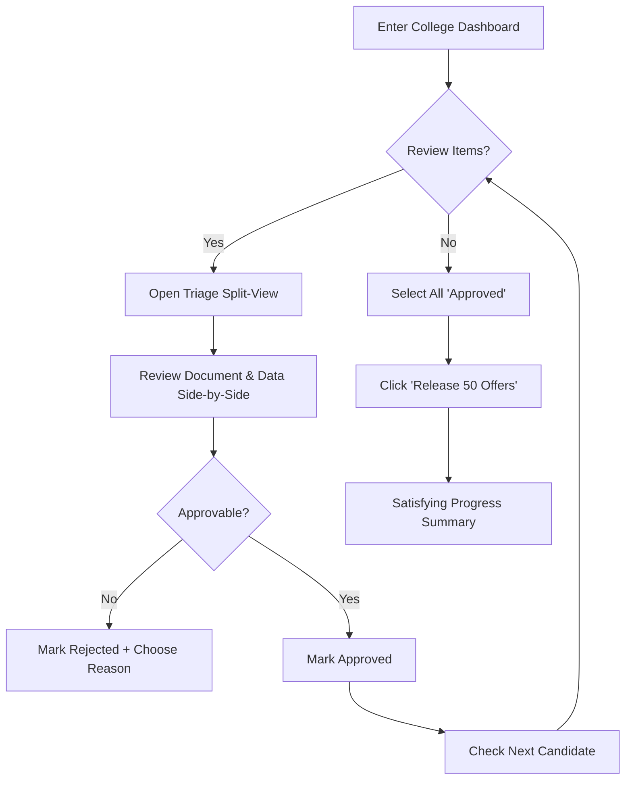

# UX Design Specification Intern Management System

**Author:** Admin
**Date:** 2026-01-15T12:05:00

---

## Executive Summary

### Project Vision

Intern Management System transforms the chaotic spreadsheet-driven internship hiring process into a structured, digital command center. By centralizing data from colleges, students, and HR, it enables a 100% accurate, high-speed recruitment pipeline where "Ready for Offer" candidates are identified in minutes instead of hours.

### Target Users

1. **Ananya (Wissen HR):** Needs a "Single Source of Truth" to handle high volumes of candidates with speed and zero data-anxiety.
2. **Mr. Sharma (College Coordinator):** Needs transparency into student progress and a frictionless way to upload candidate batches.
3. **Siddharth (Student):** Needs a simple, mobile-accessible way to submit documents and track their verification status.

### Key Design Challenges

- **High-Volume Batch Management:** Making complex status updates and data management feel light and error-proof for HR.
- **CSV Data Integrity:** Turning the technical friction of CSV uploads into a guided, approachable experience for non-technical coordinators.
- **Verification Clarity:** Providing immediate, actionable feedback to students on document rejections to prevent pipeline bottlenecks.

### Design Opportunities

- **"Ready for Offer" Command Center:** A specialized view that celebrates recruitment milestones and highlights action items.
- **Interactive Progress Visualization:** Making the 4-step recruitment funnel tangible and easy to navigate for all users.
- **Guided Document Submission:** A mobile-first, high-clarity interface that reduces document rejection rates through proactive guidance.

## Core User Experience

### Defining Experience

The core of the Intern Management System is **High-Speed Status Progression**. The system must empower HR users to move large batches of candidates through the pipeline with total confidence and minimal manual effort.

### Platform Strategy

- **HR & Coordinators:** **Desktop-First.** A productivity-focused interface with dense but highly readable data tables, powerful filtering, and robust batch actions.
- **Students:** **Mobile-First.** A streamlined, frictionless document submission and status tracking portal optimized for mobile browsers.

### Effortless Interactions

- **Precision Batch Actions:** HR can select and update dozens of candidates simultaneously with clear confirmation and undo capabilities.
- **Guided CSV Correction:** Coordinators receive immediate, line-specific visual feedback on CSV errors, making fixes effortless.
- **Proactive Progress Cues:** Small micro-interactions that guide users to the next "Success Moment" (e.g., highlighting the next document required).

### Critical Success Moments

- **The Verification Milestone:** The moment HR completes a batch verification and sees a list of students move to "Ready for Offer."
- **The Submission Relief:** The instant feedback a student receives when their document is approved, confirming they are on track.

### Experience Principles

- **Speed to Offer:** Optimization of every click and scroll to accelerate the journey from shortlist to offer.
- **Trust via Transparency:** Real-time visibility for all stakeholders, eliminating the need for manual status follow-ups.
- **Guidance over Friction:** Approaching errors as collaborative "Next Steps" rather than system blockers.

## Desired Emotional Response

### Primary Emotional Goals

- **Empowerment:** HR (Ananya) feels like an expert in control of a high-power command center.
- **Support:** Coordinators (Mr. Sharma) feel guided and successful, not burdened by data entry.
- **Momentum:** Students (Siddharth) feel a sense of progress toward their career goals.

### Emotional Journey Mapping

- **Discovery:** "Finally, a system that understands the complexity of campus hiring." (Relief/Recognition)
- **Data Input:** "This uploader is actually helping me get it right." (Competence/Collaboration)
- **Processing:** "I trust this data because I can see exactly where it came from." (Certainty/Trust)
- **Completion:** "50 students processed in minutes. I'm done!" (Tranquility/Accomplishment)

### Micro-Emotions

- **Confidence:** Clarity in error messaging and status updates.
- **Trust:** Transparent audit trails and verification stamps.
- **Delight:** Subtle visual cues acknowledging a successful batch progression.

### Design Implications

- **Dense Power Views:** Productivity-focused dashboards for HR that prioritize speed and density without sacrificing clarity.
- **Collaborative Validation:** Turning CSV error reports into interactive, fix-focused interfaces.
- **Progress Steppers:** Visual trackers for students and coordinators to maintain momentum and clarity.

### Emotional Design Principles

- **Professional Tone with Human Empathy:** A system that reflects the importance of career decisions with a supportive, clear voice.
- **Celebrate Milestones:** Small but meaningful micro-animations to acknowledge the completion of critical tasks.

## UX Pattern Analysis & Inspiration

### Inspiring Products Analysis

- **Linear & GitHub:** Benchmarks for HR's "Command Center." These products excel at managing complex, nested data and high-frequency status changes with extreme efficiency and a professional, "expert-tool" feel.
- **TurboTax & Wise:** Benchmarks for Student and Coordinator onboarding. These apps transform complex, high-stakes data entry into a guided, approachable, and transparent conversation.

### Transferable UX Patterns

- **The Command Palette:** Leveraging `Cmd+K` style global search and actions for HR to manage candidates at light speed.
- **High-Density Data Tables:** Using row-level quick actions, sticky headers, and logical grouping to handle hundreds of student records without overwhelming the user.
- **Proactive Notification Cues:** Mobile-optimized, instant feedback loops (Wise-style) for document status changes.

### Anti-Patterns to Avoid

- **Modal Overload:** Avoiding unnecessary pop-ups that break the user's flow and hide context.
- **Obfuscated Errors:** Moving away from technical error messages toward human-readable, action-oriented guidance.

### Design Inspiration Strategy

- **Adopt:** The developer-centric, high-density aesthetics of Linear/GitHub for the HR dashboard to foster a sense of professional empowerment.
- **Adapt:** The "Wizard-led" documentation journey for students, optimized for rapid mobile submission and verification.
- **Avoid:** The "Enterprise Bloat" of traditional HRIS systems—prioritizing speed, minimal navigation depth, and instant clarity.

## Design System Foundation

### Design System Choice

**Themeable System (Tailwind UI / Shadcn UI)**

### Rationale for Selection

- **Professional Aesthetics:** Provides the sleek, high-density, and modern look required for an expert-level command center.
- **Development Speed:** Accelerates the creation of complex UI elements like data tables, filter menus, and batch action bars.
- **Cross-Platform Flexibility:** Easily scales from dense desktop views for HR to lightweight, mobile-first interfaces for students.
- **Customization:** Allows for fine-tuning the visual identity to balance **Professional Trust** with **Supportive Clarity**.

### Implementation Approach

- Use **Tailwind CSS** for core styling and responsive layouts.
- Leverage **Shadcn UI** for robust, accessible, and themeable components.
- Implement a **Dark Mode** option to support high-intensity, prolonged HR usage sessions.

### Customization Strategy

- Define a custom color palette that emphasizes **Action** (Primary Blue/Indigo) and **Trust** (Neutral Grays).
- Tailor typography (Inter/Geist) for maximum legibility in high-density data views.

## 2. Core User Experience

### 2.1 Defining Experience

The defining experience of the Intern Management System is **One-Click Batch Verification** (The "Offer Accelerator"). This interaction turns a high-anxiety data-chase into a high-satisfaction command moment where dozens of students are moved to "Ready for Offer" status simultaneously.

### 2.2 User Mental Model

HR users bring a "Triage" mental model:
- **Efficiency:** "How fast can I clear the easy cases?"
- **Certainty:** "I need to be 100% sure the document matches the data before I release the offer."
- **Visibility:** "I need to know exactly what's left in the queue."

### 2.3 Success Criteria

- **Zero Doubt:** The user never wonders "did that batch save?" or "who did I just approve?"
- **Proactive Triage:** The system automatically sorts the "easiest" verifications to the top.
- **Satisfying Completion:** Every batch completion feels like a significant milestone achievement.

### 2.4 Novel UX Patterns

- **Verification Split-View:** A native, side-by-side view where HR can review student credentials and PDF transcripts in a single interface, eliminating the need to click back and forth between tabs.
- **"Offer Readiness" Multi-Select:** A specialized selection tool that highlights exactly why a student is or isn't selectable for an offer.

### 2.5 Experience Mechanics

1. **Initiation:** HR enters a College Dashboard; they are greeted with a "Triage Header" showing *Ready for Verification (24)*.
2. **Triage Loop:** HR uses keyboard shortcuts (`j/k` to cycle, `space` to select) in the Split-View to quickly verify IDs and transcripts.
3. **Action:** A "Batch Release" button appears as soon as multiple students are marked "Docs Approved."
4. **Feedback:** A "Status Pulse" animation transitions students to the "Offer Released" column.
5. **Completion:** A summary screen shows: *50 Offers Released | 0 Errors | Next College: XYZ University.*

## Visual Design Foundation

### Color System

The color system is designed to balance **High-Trust Professionalism** with **High-Speed Action**.
- **Primary Action (Deep Indigo/Blue):** Used for critical UI calls-to-action and primary buttons, signaling authority and expert focus.
- **Success (Emerald Green):** For "Offer Released" and "Approved" states, providing positive reinforcement.
- **Error/Warning (Rose Red/Amber):** For clear, actionable feedback on document rejections or missing data.
- **Neutral Surfaces (Zinc/Gray):** A sophisticated neutral palette that supports high-density data views in both light and dark modes.

### Typography System

- **Secondary Typeface:** **Inter / Geist.** Chosen for exceptional legibility at small sizes within dense data tables and side-panels.
- **Type Scale:** A compact, productivity-focused scale that maximizes vertical space for data visibility while maintaining clear hierarchical headings.

### Spacing & Layout Foundation

- **8px Base Grid:** A consistent structural unit for all components, padding, and margins.
- **High-Density Spacing:** Tight padding within the HR and Coordinator dashboards to prioritize data visibility and reduce excessive scrolling.
- **Side-Pane Architecture:** A structural pattern where detail views and previews slide from the right, keeping the main context always visible.

### Accessibility Considerations

- **Contrast Compliance:** Ensuring all text and icon combinations meet WCAG 2.1 AA standards for readability.
- **Clear Focus States:** High-visibility focus rings for keyboard navigation, supporting the "High-Speed" HR workflow.
- **Semantic Color Usage:** Colors never used as the only indicator of status; redundant icons and labels provided throughout.

---

## Design Direction Decision

### Design Directions Explored

- **Option 1: The "Linear" Pro:** High-density, expert-centric tool using dark mode and keyboard acceleration.
- **Option 2: The Guidance-First:** Supportive, card-based interface with heavy visual cues and friendly iconography.
- **Option 3: The SaaS Modern:** Clean, whiteboard-centric dashboard emphasizing high-level metrics and legibility.

### Chosen Direction

**The "Hybrid Pro" Approach**

### Design Rationale

- **Role-Based Optimization:** Acknowledging that different users have fundamentally different needs. HR requires the **"Linear Pro"** density for high-volume recruitment, while Students and Coordinators require the **"Guidance-First"** clarity for document submission.
- **Consistent Token Foundation:** Both styles share the same core color palette and typography tokens, ensuring the product feels like a single unified platform even as the interaction density shifts.
- **Productivity vs. Education:** Prioritizes speed for daily experts (HR) and guidance for occasional users (Students).

---

## User Journey Flows

### 3.1 HR "Offer Accelerator" Flow
Goal: Move students from "Application" to "Ready for Offer" as fast as possible.



### 3.2 Coordinator "Frictionless Upload" Flow
Goal: Get student data into the system with zero "tech-anxiety."

```mermaid
graph TD
    L[Drag & Drop CSV] --> M[Instant Background Validation]
    M --> N{Errors Found?}
    N -- Yes --> O[Open Inline Error Editor]
    O --> P[Fix Cell-by-Cell with Visual Cues]
    P --> M
    N -- No --> Q[Preview Student Count & Data]
    Q --> R[Click 'Confirm Submission']
    R --> S[Visibility Pulse: "Pending HR Review"]
```

### 3.3 Student "Re-Upload Rescue" Flow
Goal: Fix document errors immediately on mobile.

```mermaid
graph TD
    T[Receive 'Action Required' SMS/Push] --> U[Click Link to Mobile Portal]
    U --> V[See Rejected Doc + Clear Reason]
    V --> W[Tap 'Retake Photo / Upload']
    W --> X[Camera Interaction / File Select]
    X --> Y[Confirm Submission]
    Y --> Z[Success: "Verified by System"]
```

### Flow Optimization Principles
- **HR:** Optimized for **Keyboard Speed** via the Split-View triage interface.
- **Coordinator:** Optimized for **Technical Support** with inline spreadsheet-style error correction.
- **Student:** Optimized for **Mobile Immediacy** via notification-to-portal direct linking.

---

## Component Strategy

### Design System Components
We leverage **Shadcn UI** and **Tailwind CSS** for the core foundation, ensuring accessibility and high-quality defaults for:
- **Navigation:** Deep Sidebar, Breadcrumbs, Step Indicators.
- **Data Display:** Dense Tables, Progress Bars, Status Badges.
- **Inputs:** Drag & Drop File Uploaders, Multi-select Comboboxes.

### Custom Components

#### 4.1 The Triage Split-View (HR)
- **Purpose:** Parallel review of candidate data and proof-of-credentials.
- **Anatomy:** Left Panel (Applicant Profile/Data) | Center Panel (Scrollable PDF Content) | Right Sidebar (Status Actions).
- **Interactions:** Keyboard shortcuts (`j/k` for navigation, `space` to toggle selection).

#### 4.2 The Inline CSV Error Editor (Coordinator)
- **Purpose:** Frictionless recovery from data-entry errors.
- **Anatomy:** Tabular grid with red-highlighted cells indicating validation failures.
- **Interactions:** Tooltip-based error explanations on cell hover; instant re-validation on blur.

#### 4.3 The "Offer Readiness" Indicator (HR)
- **Purpose:** At-a-glance confirmation of a student's eligibility for an offer.
- **Anatomy:** Dynamic multi-segment status bar showing progress of all required documents.

### Implementation Roadmap
- **Critical (Phase 1):** Dense Data Table + Triage Split-View + File Uploader.
- **Support (Phase 2):** Inline CSV Editor + Offer Readiness Badge + Notifications.
- **Enhancement (Phase 3):** Keyboard Command Palette + Subtle Micro-Animations.

---

## UX Consistency Patterns

### Button Hierarchy
- **Primary Action (Solid Indigo):** For the critical path (e.g., *Release Offers*). One per screen.
- **Secondary Action (Outline):** For supporting tasks (e.g., *Edit Info*, *Cancel*).
- **Destructive (Solid Red):** For irreversible actions (e.g., *Reject Student*). Requires confirmation.

### Feedback Patterns
- **Success (Emerald Toast):** Instant confirmation (e.g., "50 Students moved to Ready").
- **Error (Rose Inline):** Action-oriented guidance (e.g., "Column 'GPA' is missing in row 12").
- **Progress (Indeterminate Bar):** Used during CSV validation or batch processing.
- **Empty States:** Proactive prompts with clear next steps (e.g., "No students found. Try uploading a CSV").

### Form & Input Patterns
- **Inline Validation:** Validating on blur/input to reduce submission anxiety.
- **Keyboard Forward:** Full keyboard support (`Tab`, `Enter`) for HR and Coordinator workflows.
- **Smart Defaults:** Pre-filling context-aware data (e.g., college names) to reduce friction.

### Navigation & Detail Patterns
- **Side-Pane detail:** Detail views slide from the right, maintaining list context.
- **Pinned Headers:** Search and filter bars stay visible during long scrolls.

---

## Responsive Design & Accessibility

### Responsive Strategy
- **Desktop (HR & Coordinators):** Focus on information density. We use multi-column "Pro" layouts with pinned navigation and split-view triage panes to minimize vertical scrolling and clicking.
- **Mobile (Students):** Focus on task-completion momentum. We use a mobile-first "Wizard" approach with bottom-anchored action bars and high-contrast touch targets (min 44px).
- **Tablet:** A flexible mid-point using collapsible sidebars and responsive grid adaptation to maintain legibility without sacrificing data density.

### Breakpoint Strategy
- **Mobile:** 320px - 767px (Single column, high focus).
- **Tablet:** 768px - 1023px (Collapsible sidebar, touch-optimized).
- **Desktop:** 1024px+ (Pinnable detail panes, high density).

### Accessibility Strategy (WCAG 2.1 AA)
- **Visual Clarity:** All text and icons maintain a minimum 4.5:1 contrast ratio. status is never communicated by color alone (always paired with icons/labels).
- **Keyboard Power:** Comprehensive keyboard navigation support (`j/k` for lists, `Tab` focus management) for HR and Coordinator "Pro" workflows.
- **Screen Reader Support:** Semantic HTML structures with appropriate ARIA roles and labels for dynamic status updates and data tables.

### Testing & Implementation
- **Cross-Device Testing:** Validating layouts on actual mobile devices and across Chrome, Safari, and Firefox.
- **Inclusive Testing:** Using automated tools (e.g., Axe) and manual screen reader testing (VoiceOver/NVDA) to ensure standard compliance.
- **Framework Support:** Standardizing on Tailwind's responsive utilities and Shadcn's accessible component primitives.

<!-- UX design content will be appended sequentially through collaborative workflow steps -->
